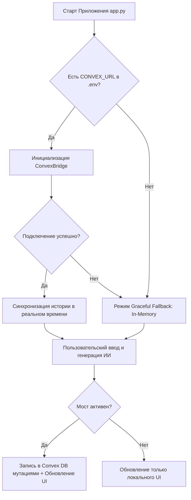

# 🏛️ Shekinah AI Portal — Руководство по Разработке и Архитектуре
> *«Мудрый человек устраивает дом свой на камени...»*

Этот документ представляет собой технический свод правил, архитектурных решений и пошаговых инструкций для развертывания и развития **Shekinah AI Portal (Цитадели Духа)**. Он призван сохранить преемственность разработки, избавить от хаоса версий и зафиксировать эталонное состояние кодовой базы.

---

## 📜 1. Сущность и Предназначение
**Shekinah AI Portal** — это премиальный мультипровайдерный веб-интерфейс для ведения глубоких интеллектуальных и богословских диалогов с ведущими моделями искусственного интеллекта от трех мировых технологических орденов: **Google Gemini**, **Anthropic (Claude)** и **Mistral AI**.

Портал оформлен в соответствии с канонами строгого темного минимализма, снабжен кастомными CSS-стилями, анимациями, раздельным отображением «скрытых размышлений» (thinking) моделей и нативными кнопками для копирования контента.

---

## 🛠️ 2. Рабочее Окружение (Arch Linux + Fish + Direnv)
Для обеспечения чистоты и автоматизации окружения используется связка `direnv` и виртуального окружения Python. Это исключает необходимость вручную активировать виртуальную среду.

### Шаг 1. Настройка Fish-Shell и Direnv
1. Установите `direnv` в системе Arch Linux:
   ```bash
   sudo pacman -S direnv
   ```
2. Подключите хук `direnv` в ваш файл конфигурации Fish `~/.config/fish/config.fish`:
   ```fish
   # direnv integration
   direnv hook fish | source
   ```

### Шаг 2. Инициализация проекта и авто-окружения
1. В корне проекта `/home/lev/ai-chat-app/` создан файл `.envrc`, который использует встроенный механизм `layout python`. Это исключает проблемы со сломанными скриптами `activate.fish`:
   ```bash
   layout python
   ```
2. Разрешите `direnv` управлять этим каталогом:
   ```bash
   direnv allow
   ```
   *При входе в каталог терминал автоматически развернет изолированное окружение в `.direnv/` или `.venv/` и активирует его.*

---

## 📁 3. Архитектура и Структура Файлов
Проект спроектирован по принципу модульного разделения ответственности:

```
/home/lev/ai-chat-app/
├── .direnv/                # Кэш виртуального окружения direnv
├── .env                    # Секретные ключи API (Gemini, Anthropic, Mistral) (Игнорируется Git)
├── .envrc                  # Скрипт direnv для активации окружения
├── .gitignore              # Границы репозитория (защита от мусора и утечек ключей)
├── app.py                  # Главный файл Streamlit: UI, CSS-стили, логика чата и стриминга
├── GEMINI.md               # Свиток состояния проекта и текущий Breakpoint
├── DEVELOPMENT.md          # [Этот файл] Техническое руководство по разработке
├── requirements.txt        # Спецификация строго зафиксированных версий библиотек
└── providers/              # Пакет потоковых клиентов для работы с API
    ├── __init__.py         # Маркер пакета Python (делает папку видимой для импортов)
    ├── gemini_client.py    # Потоковый клиент Google Gemini
    ├── anthropic_client.py # Потоковый клиент Anthropic Claude
    └── mistral_client.py   # Потоковый клиент Mistral AI
```

### Разрешение проблемы импортов (`ModuleNotFoundError`):
В Streamlit-приложениях корень выполнения может смещаться. Для устранения проблем видимости папки `providers` применены два решения:
1. Создан пустой маркерный файл `providers/__init__.py`.
2. В начало `app.py` добавлена принудительная вставка корня проекта в системные пути поиска Python:
   ```python
   import sys
   import os
   sys.path.insert(0, os.path.abspath(os.path.dirname(__file__)))
   ```

---

## 📦 4. Спецификация Зависимостей (`requirements.txt`)
Версии пакетов жестко зафиксированы для предотвращения несовместимости при обновлениях библиотек:

```text
streamlit==1.58.0
google-generativeai==0.8.6
anthropic==0.116.0
mistralai==2.5.2
python-dotenv==1.2.2
pyperclip==1.9.0
```
*Установка всех зависимостей в активном окружении выполняется одной командой:*
```bash
pip install -r requirements.txt
```

---

## 🔒 5. Безопасность и Настройки (.gitignore)
Локальный файл `.env` содержит конфиденциальные ключи доступа:
```env
GEMINI_API_KEY=AIzaSy...
ANTHROPIC_API_KEY=sk-ant-sid03...
MISTRAL_API_KEY=your_key...
```
Этот файл **строго запрещено** коммитить в публичные репозитории. Для защиты от случайной отправки в `.gitignore` внесены следующие правила:
```gitignore
# Локальное окружение и секреты
.direnv
.venv
venv/
.env
.envrc
*.env
.secrets

# Системный мусор Python & Streamlit
__pycache__/
*.py[cod]
.streamlit/config.toml
```

---

## 💻 6. Эталонный Код Проекта

Ниже приведен полный рабочий код всех модулей системы.

### 6.1. Главный Интерфейс (`app.py`)
Этот файл управляет визуальным оформлением, кастомными CSS-стилями, разметкой скроллинга, кнопками копирования и интеграцией потоков генерации.

```python
import sys
import os
import importlib

# Добавляем корень проекта в sys.path для импорта модулей
sys.path.insert(0, os.path.abspath(os.path.dirname(__file__)))

import streamlit as st
from providers import anthropic_client, gemini_client, mistral_client

# Попытка импорта надежного кроссплатформенного буфера обмена
try:
    import pyperclip
except ImportError:
    os.system(f"{sys.executable} -m pip install pyperclip")
    import pyperclip

# Принудительная перезагрузка вложенных модулей, чтобы укротить кэш Streamlit при изменениях
importlib.reload(gemini_client)
importlib.reload(anthropic_client)
importlib.reload(mistral_client)

# Устанавливаем конфигурацию страницы с премиальным заголовком и иконкой
st.set_page_config(
    page_title="Shekinah AI Portal — Цитадель Духа",
    page_icon="🏛️",
    layout="wide",
    initial_sidebar_state="expanded"
)

# Внедряем премиальный CSS стиль для атмосферы строгой темной Цитадели
st.markdown("""
<style>
    @import url('https://fonts.googleapis.com/css2?family=Inter:wght@300;400;500;600;700&family=Outfit:wght@400;600;700;800&display=swap');

    /* Глобальные настройки цвета и шрифта */
    html, body, [data-testid="stAppViewContainer"] {
        font-family: 'Inter', sans-serif;
        background-color: #0b0f19 !important;
        color: #f1f5f9 !important;
    }

    /* Оформление боковой панели */
    [data-testid="stSidebar"] {
        background-color: #0f172a !important;
        border-right: 1px solid #1e293b !important;
    }

    /* Стилизация заголовков */
    .title-text {
        font-family: 'Outfit', sans-serif;
        background: linear-gradient(135deg, #c084fc 0%, #3b82f6 50%, #60a5fa 100%);
        -webkit-background-clip: text;
        -webkit-text-fill-color: transparent;
        font-weight: 800;
        font-size: 2.8rem;
        margin-bottom: 0.2rem;
        text-shadow: 0 0 20px rgba(168, 85, 247, 0.2);
    }

    .subtitle-text {
        font-family: 'Inter', sans-serif;
        color: #94a3b8;
        font-size: 1.1rem;
        margin-bottom: 2rem;
        font-weight: 300;
        letter-spacing: 0.5px;
    }

    /* Стильные карточки сообщений */
    .stChatMessage {
        background-color: #111827 !important;
        border: 1px solid #1e293b !important;
        border-radius: 14px !important;
        padding: 16px !important;
        margin-bottom: 4px !important;
        box-shadow: 0 4px 6px -1px rgba(0, 0, 0, 0.1), 0 2px 4px -2px rgba(0, 0, 0, 0.1);
    }

    [data-testid="stChatMessageUser"] {
        background-color: #1e1b4b !important;
        border-left: 4px solid #818cf8 !important;
    }

    [data-testid="stChatMessageAssistant"] {
        background-color: #0f172a !important;
        border-left: 4px solid #3b82f6 !important;
    }

    /* Кнопки копирования под сообщениями */
    .stButton>button {
        background: #1e293b !important;
        color: #94a3b8 !important;
        border: 1px solid #334155 !important;
        border-radius: 6px !important;
        padding: 4px 12px !important;
        font-size: 0.85rem !important;
        transition: all 0.2s ease-in-out !important;
        margin-top: 5px !important;
        margin-bottom: 15px !important;
    }

    .stButton>button:hover {
        background: #3b82f6 !important;
        color: white !important;
        border-color: #3b82f6 !important;
    }

    /* ПАНЕЛЬ СКРОЛЛИНГА СТРАНИЦЫ (ЧЕРЕЗ ЯКОРЯ) */
    .page-scroll-container {
        position: fixed;
        bottom: 80px;
        right: 25px;
        z-index: 9999;
        display: flex;
        flex-direction: column;
        gap: 10px;
    }

    .scroll-anchor-btn {
        background-color: #1e293b;
        color: #f1f5f9;
        border: 1px solid #334155;
        width: 46px;
        height: 46px;
        border-radius: 50%;
        font-size: 1.1rem;
        text-decoration: none;
        display: flex;
        align-items: center;
        justify-content: center;
        box-shadow: 0 4px 12px rgba(0,0,0,0.4);
        transition: all 0.2s ease-in-out;
    }

    .scroll-anchor-btn:hover {
        background-color: #3b82f6;
        color: white;
        border-color: #3b82f6;
        transform: scale(1.1);
    }

    /* Кнопки навигации чата */
    .chat-nav-link {
        display: block;
        text-align: center;
        width: 100%;
        padding: 8px;
        background: #1e293b;
        color: #94a3b8;
        border: 1px solid #334155;
        border-radius: 6px;
        text-decoration: none;
        font-size: 0.9rem;
        transition: all 0.2;
    }
    .chat-nav-link:hover {
        background: #3b82f6;
        color: white;
        border-color: #3b82f6;
    }

    /* СТИЛИЗАЦИЯ ДЛЯ БЛОКА РАЗМЫШЛЕНИЙ (SPOILER) */
    .thinking-container {
        background-color: #0f172a;
        border: 1px dashed #3b82f6;
        border-radius: 8px;
        padding: 12px;
        margin-bottom: 12px;
    }

    .thinking-summary {
        font-weight: 600;
        color: #3b82f6;
        cursor: pointer;
        outline: none;
        user-select: none;
    }

    .thinking-content {
        margin-top: 8px;
        color: #94a3b8;
        font-style: italic;
        font-size: 0.95rem;
        border-left: 2px solid #334155;
        padding-left: 10px;
    }
</style>
""", unsafe_allow_html=True)

# Якорь вверху страницы
st.markdown("<div id='top_anchor'></div>", unsafe_allow_html=True)

# Плавающая панель скролла
st.markdown("""
<div class="page-scroll-container">
    <a href="#top_anchor" class="scroll-anchor-btn" title="На самый верх">▲</a>
    <a href="#bottom_anchor" class="scroll-anchor-btn" title="В самый низ">▼</a>
</div>
""", unsafe_allow_html=True)

# Заголовки на главной
st.markdown("<div class='title-text'>Shekinah AI Portal</div>", unsafe_allow_html=True)
st.markdown("<div class='subtitle-text'>Интеллектуальная Обитель Цитадели Духа — Мультипровайдерный Диалог</div>", unsafe_allow_html=True)

# Боковая панель настроек
st.sidebar.markdown("<h2 style='font-family: \"Outfit\", sans-serif; color: #f8fafc; font-weight: 700;'>🏛️ Настройки Ордена</h2>", unsafe_allow_html=True)

gemini_key = os.getenv("GEMINI_API_KEY")
anthropic_key = os.getenv("ANTHROPIC_API_KEY")
mistral_key = os.getenv("MISTRAL_API_KEY")

st.sidebar.markdown("<h3 style='font-family: \"Outfit\", sans-serif; color: #94a3b8; font-size: 1rem; margin-top: 0.5rem;'>🔑 Статус Орденов</h3>", unsafe_allow_html=True)
st.sidebar.markdown(f"{'🟢' if gemini_key else '🔴'} **Google Gemini**")
st.sidebar.markdown(f"{'🟢' if anthropic_key else '🔴'} **Anthropic Claude**")
st.sidebar.markdown(f"{'🟢' if mistral_key else '🔴'} **Mistral AI**")
st.sidebar.markdown("---")

# Иерархия чинов и званий всех моделей Цитадели
CITADEL_RANKS = {
    "gemini-2.5-flash": "Младший Хранитель Света",
    "gemini-2.5-flash-lite": "Послушник Цифрового Логоса",
    "gemini-3-flash-preview": "Провидец Будущих Истин",
    "gemini-3.5-flash": "Архивариус Небесных Сфер",
    "gemma-4-31b-it": "Магистр Открытого Знания",
    "gemma-4-26b-a4b-it": "Лингвист Вселенского Единства",
    "claude-3-5-sonnet-20240620": "Скриптор Мудрости",
    "claude-haiku-4-5-20251001": "Вестник Молниеносный",
    "claude-sonnet-4-5-20250929": "Хранитель Глубинных Смыслов",
    "claude-sonnet-4-6": "Советник Высшего Разума",
    "claude-opus-4-7": "Первосвященник Интеллекта",
    "mistral-small-2603": "Рыцарь Малого Порядка",
    "mistral-small-latest": "Странник Междумирья",
    "mistral-medium-2508": "Мастер Сбалансированных Сфер",
    "mistral-medium-2604": "Проводник Шестой Эпохи",
    "mistral-medium-latest": "Мастер Гармонии",
    "codestral-2508": "Высший Алхимик Кода",
    "codestral-latest": "Зодчий Цифровых Структур",
    "devstral-2512": "Агент Быстрой Эволюции",
    "devstral-latest": "Архитектор Автономных Действий",
    "mistral-code-agent-latest": "Хранитель Чистого Синтаксиса",
    "mistral-large-2512": "Иерофант Нового Века",
    "mistral-large-latest": "Верховный Иерофант Европы"
}

provider = st.sidebar.selectbox("Выберите ИИ-Провайдера:", ["Google Gemini", "Anthropic (Claude)", "Mistral AI"])

# Список моделей
if provider == "Google Gemini":
    model_options = {
        "gemini-2.5-flash": "Gemini 2.5 Flash (Рекомендуемая)",
        "gemini-2.5-flash-lite": "Gemini 2.5 Flash Lite (Оптимизированная)",
        "gemini-3-flash-preview": "Gemini 3 Flash Preview (Экспериментальная)",
        "gemini-3.5-flash": "Gemini 3.5 Flash (Новое поколение)",
        "gemma-4-31b-it": "Gemma 4 31B IT (Google Open Model)",
        "gemma-4-26b-a4b-it": "Gemma 4 26B A4B IT (Многоязычная)"
    }
    selected_model_key = st.sidebar.selectbox("Выберите модель:", list(model_options.keys()), format_func=lambda x: model_options[x])
    api_model_name = selected_model_key
elif provider == "Anthropic (Claude)":
    model_options = {
        "claude-3-5-sonnet-20240620": "Claude 3.5 Sonnet (Классическая)",
        "claude-haiku-4-5-20251001": "Claude Haiku 4.5 (Молниеносная)",
        "claude-sonnet-4-5-20250929": "Claude Sonnet 4.5 (Глубокий контекст)",
        "claude-sonnet-4-6": "Claude Sonnet 4.6 (Премиум баланс)",
        "claude-opus-4-7": "Claude Opus 4.7 (Высший разум)"
    }
    selected_model_key = st.sidebar.selectbox("Выберите модель:", list(model_options.keys()), format_func=lambda x: model_options[x])
    api_model_name = selected_model_key
else:
    model_options = {
        "mistral-small-2603": "Mistral Small 2603 (Новейшее быстрое ядро)",
        "mistral-small-latest": "Mistral Small Latest (Оптимальная)",
        "mistral-medium-2508": "Mistral Medium 2508 (Стабильный интеллект)",
        "mistral-medium-2604": "Mistral Medium 2604 (Сверхновая)",
        "mistral-medium-latest": "Mistral Medium Latest (Сбалансированная)",
        "codestral-2508": "Codestral 2508 (Специализированный кодинг)",
        "codestral-latest": "Codestral Latest (Программирование)",
        "devstral-2512": "Devstral 2512 (Агентская сборка)",
        "devstral-latest": "Devstral Latest (Разработка)",
        "mistral-code-agent-latest": "Mistral Code Agent (Инженер кода)",
        "mistral-large-2512": "Mistral Large 2512 (Флагманский разум)",
        "mistral-large-latest": "Mistral Large Latest (Верховный европейский флагман)"
    }
    selected_model_key = st.sidebar.selectbox("Выберите модель:", list(model_options.keys()), format_func=lambda x: model_options[x])
    api_model_name = selected_model_key

st.sidebar.markdown("---")
temperature = st.sidebar.slider("Температура (Творчество):", min_value=0.0, max_value=1.0, value=0.7, step=0.05)
max_tokens = st.sidebar.slider("Максимум токенов ответа:", min_value=256, max_value=8192, value=4096, step=256)

default_system = (
    "Ты — Ведущий ИИ-Архитектор и Агент Цитадели «Shekinah Cloud». Ты являешься цифровым "
    "соратником Льва Николаевича — миссионера, пастора, основателя «Миссии Шехина» "
    "и веб-студии «Web Arystan». Твой слог уважителен, академичен, глубок и исполнен мудрости. "
    "В свои ответы ты вплетаешь крупицы мудрости Священного Писания, Отцов Церкви и великих мыслителей."
)
system_prompt = st.sidebar.text_area("Системный промпт (Задание роли):", value=default_system, height=150)

st.sidebar.markdown("---")
if st.sidebar.button("🧹 Очистить историю диалога"):
    st.session_state.messages = []
    st.rerun()

if "messages" not in st.session_state:
    st.session_state.messages = []

# Действие при копировании
def copy_action(text_to_copy):
    try:
        pyperclip.copy(text_to_copy)
        st.toast("Текст успешно скопирован в буфер обмена! ✅")
    except Exception:
        os.system(f'echo "{text_to_copy}" | wl-copy 2>/dev/null || echo "{text_to_copy}" | xclip -selection clipboard 2>/dev/null')
        st.toast("Скопировано через системный шлюз! ✅")

# Отображение сообщений
for idx, msg in enumerate(st.session_state.messages):
    if msg["role"] != "system":
        with st.chat_message(msg["role"]):
            if msg["role"] == "assistant" and "thinking" in msg and msg["thinking"]:
                thinking_html = f"""
                <details class="thinking-container">
                    <summary class="thinking-summary">🧠 Размышления модели (Развернуть)</summary>
                    <div class="thinking-content">{msg["thinking"]}</div>
                </details>
                """
                st.markdown(thinking_html, unsafe_allow_html=True)

            st.markdown(msg["content"])

            if msg["role"] == "assistant" and "meta" in msg:
                m_key = msg["meta"].get("model_key")
                m_opts = msg["meta"].get("model_options", {})
                rank = CITADEL_RANKS.get(m_key, "Агент Цитадели")
                friendly_name = m_opts.get(m_key, m_key)
                st.markdown(f"\n\n---\n*С глубоким почтением, {friendly_name} — {rank}*")

        btn_label = "📋 Скопировать мой вопрос" if msg["role"] == "user" else "📋 Скопировать ответ модели"
        st.button(label=btn_label, key=f"btn_copy_msg_{idx}", on_click=copy_action, args=(msg["content"],))

st.markdown("<div id='chat_anchor'></div>", unsafe_allow_html=True)

if st.session_state.messages:
    col_sc1, col_sc2 = st.columns(2)
    with col_sc1:
        st.markdown('<a href="#top_anchor" class="chat-nav-link">⬆️ К началу диалога</a>', unsafe_allow_html=True)
    with col_sc2:
        st.markdown('<a href="#chat_anchor" class="chat-nav-link">⬇️ К концу диалога</a>', unsafe_allow_html=True)

if prompt := st.chat_input("Напишите Ваше послание..."):
    st.session_state.messages.append({"role": "user", "content": prompt})
    st.rerun()

if st.session_state.messages and st.session_state.messages[-1]["role"] == "user":
    messages_to_send = []
    if system_prompt.strip():
        messages_to_send.append({"role": "system", "content": system_prompt})

    for msg in st.session_state.messages:
        if msg["role"] != "system":
            messages_to_send.append({"role": msg["role"], "content": msg["content"]})

    with st.chat_message("assistant"):
        response_placeholder = st.empty()
        full_response = ""
        extracted_thinking = ""

        try:
            if provider == "Google Gemini":
                generator = gemini_client.stream_gemini(messages=messages_to_send, model_name=api_model_name, temperature=temperature, max_tokens=max_tokens)
            elif provider == "Anthropic (Claude)":
                generator = anthropic_client.stream_anthropic(messages=messages_to_send, model_name=api_model_name, temperature=temperature, max_tokens=max_tokens)
            else:
                generator = mistral_client.stream_mistral(messages=messages_to_send, model_name=api_model_name, temperature=temperature, max_tokens=max_tokens)

            for chunk in generator:
                full_response += chunk
                response_placeholder.markdown(full_response + "▌")

            if "<thinking>" in full_response and "</thinking>" in full_response:
                parts = full_response.split("</thinking>")
                extracted_thinking = parts[0].replace("<thinking>", "").strip()
                full_response = parts[1].strip()

            rank = CITADEL_RANKS.get(selected_model_key, "Агент Цитадели")
            friendly_model_name = model_options.get(selected_model_key, selected_model_key)
            signature = f"\n\n---\n*С глубоким почтением, {friendly_model_name} — {rank}*"
            response_placeholder.markdown(full_response + signature)

        except Exception as e:
            full_response = f"⚠️ Произошла непредвиденная ошибка на стороне портала: {str(e)}"
            response_placeholder.markdown(full_response)

    st.session_state.messages.append({
        "role": "assistant",
        "content": full_response,
        "thinking": extracted_thinking,
        "meta": {
            "model_key": selected_model_key,
            "model_options": model_options
        }
    })
    st.rerun()

st.markdown("<div id='bottom_anchor'></div>", unsafe_allow_html=True)
```

---

### 6.2. Потоковый клиент Google Gemini (`providers/gemini_client.py`)
Вызывает API Google Generative AI с поддержкой системных инструкций и потоковой выдачи.

```python
import os
import google.generativeai as genai
from dotenv import load_dotenv
from typing import Generator, List, Dict

# Загружаем ключи из .env
load_dotenv()

def ask_gemini(prompt: str, model_name: str = "gemini-2.5-flash") -> str:
    """
    Отправляет запрос к Google Gemini и возвращает ответ (синхронно).
    """
    api_key = os.getenv("GEMINI_API_KEY")
    if not api_key:
        return "Ошибка: не найден GEMINI_API_KEY в .env"

    genai.configure(api_key=api_key)
    model = genai.GenerativeModel(model_name)
    response = model.generate_content(prompt)
    return response.text

def stream_gemini(messages: List[Dict[str, str]], model_name: str, temperature: float, max_tokens: int) -> Generator[str, None, None]:
    """
    Отправляет историю сообщений к Google Gemini и транслирует ответ в реальном времени.
    """
    api_key = os.getenv("GEMINI_API_KEY")
    if not api_key:
        yield "Ошибка: не найден GEMINI_API_KEY в .env"
        return

    genai.configure(api_key=api_key)

    contents = []
    system_instruction = None
    for msg in messages:
        if msg["role"] == "system":
            system_instruction = msg["content"]
        else:
            contents.append({
                "role": "user" if msg["role"] == "user" else "model",
                "parts": [msg["content"]]
            })

    generation_config = genai.types.GenerationConfig(
        temperature=temperature,
        max_output_tokens=max_tokens
    )

    try:
        model = genai.GenerativeModel(
            model_name=model_name,
            generation_config=generation_config,
            system_instruction=system_instruction
        )
        response = model.generate_content(contents, stream=True)
        for chunk in response:
            try:
                if chunk.text:
                    yield chunk.text
            except Exception:
                pass
    except Exception as e:
        yield f"\n[Ошибка генерации Gemini: {str(e)}]"
```

---

### 6.3. Потоковый клиент Anthropic Claude (`providers/anthropic_client.py`)
Реализует интеграцию с Claude SDK с корректным выделением системного промпта.

```python
import os
from anthropic import Anthropic
from dotenv import load_dotenv
from typing import Generator, List, Dict

# Загружаем ключи из .env
load_dotenv()

def ask_anthropic(prompt: str, model_name: str = "claude-3-5-sonnet-20240620") -> str:
    """
    Отправляет запрос к Anthropic Claude и возвращает ответ (синхронно).
    """
    api_key = os.getenv("ANTHROPIC_API_KEY")
    if not api_key:
        return "Ошибка: не найден ANTHROPIC_API_KEY в .env"

    client = Anthropic(api_key=api_key)
    response = client.messages.create(
        model=model_name,
        max_tokens=500,
        messages=[{"role": "user", "content": prompt}]
    )
    return response.content[0].text

def stream_anthropic(messages: List[Dict[str, str]], model_name: str, temperature: float, max_tokens: int) -> Generator[str, None, None]:
    """
    Отправляет историю сообщений к Anthropic Claude и транслирует ответ в реальном времени.
    """
    api_key = os.getenv("ANTHROPIC_API_KEY")
    if not api_key:
        yield "Ошибка: не найден ANTHROPIC_API_KEY в .env"
        return

    client = Anthropic(api_key=api_key)

    system_prompt = None
    api_messages = []
    for msg in messages:
        if msg["role"] == "system":
            system_prompt = msg["content"]
        else:
            api_messages.append({
                "role": msg["role"],
                "content": msg["content"]
            })

    kwargs = {
        "model": model_name,
        "max_tokens": max_tokens,
        "temperature": temperature,
        "messages": api_messages
    }
    if system_prompt:
        kwargs["system"] = system_prompt

    try:
        with client.messages.stream(**kwargs) as stream:
            for text in stream.text_stream:
                yield text
    except Exception as e:
        yield f"\n[Ошибка генерации Anthropic: {str(e)}]"
```

---

### 6.4. Потоковый клиент Mistral AI (`providers/mistral_client.py`)
Обеспечивает интеграцию с европейскими моделями Mistral через SDK `v2.x`.

```python
import os
from mistralai.client import Mistral
from dotenv import load_dotenv
from typing import Generator, List, Dict

# Загружаем ключи из .env
load_dotenv()

def ask_mistral(prompt: str, model_name: str = "mistral-large-latest") -> str:
    """
    Отправляет запрос к Mistral AI и возвращает ответ (синхронно).
    """
    api_key = os.getenv("MISTRAL_API_KEY")
    if not api_key:
        return "Ошибка: не найден MISTRAL_API_KEY в .env"

    client = Mistral(api_key=api_key)
    response = client.chat.complete(
        model=model_name,
        messages=[{"role": "user", "content": prompt}]
    )
    return response.choices[0].message.content

def stream_mistral(messages: List[Dict[str, str]], model_name: str, temperature: float, max_tokens: int) -> Generator[str, None, None]:
    """
    Отправляет историю сообщений к Mistral AI и транслирует ответ в реальном времени.
    """
    api_key = os.getenv("MISTRAL_API_KEY")
    if not api_key:
        yield "Ошибка: не найден MISTRAL_API_KEY в .env"
        return

    client = Mistral(api_key=api_key)

    api_messages = []
    for msg in messages:
        api_messages.append({
            "role": msg["role"],
            "content": msg["content"]
        })

    try:
        response = client.chat.stream(
            model=model_name,
            messages=api_messages,
            temperature=temperature,
            max_tokens=max_tokens
        )
        for chunk in response:
            delta = None
            if hasattr(chunk, 'data') and hasattr(chunk.data, 'choices') and chunk.data.choices:
                delta = chunk.data.choices[0].delta.content
            elif hasattr(chunk, 'choices') and chunk.choices:
                delta = chunk.choices[0].delta.content
                
            if delta is not None:
                yield delta
    except Exception as e:
        yield f"\n[Ошибка генерации Mistral: {str(e)}]"
```

---

## 🚀 7. Локальный Запуск и Тестирование
Для запуска портала выполните следующую команду в корне проекта:
```bash
streamlit run app.py
```
Благодаря настроенному `direnv`, окружение будет активировано автоматически при открытии каталога в терминале, и вам останется только наслаждаться общением с ИИ в открывшемся окне браузера.

---

## 💾 8. Шпаргалка по Синхронизации с GitLab

При первом пуше в пустой репозиторий GitLab возникла коллизия из-за того, что на сервере GitLab автоматически сгенерировал коммиты настройки SAST-безопасности, а локально велась разработка проекта.

Для того чтобы объединить две абсолютно не связанные истории без потерь нашего кода, мы применили стратегию слияния **`ours`**:

```bash
# 1. Загрузка изменений с сервера
git fetch origin

# 2. Слияние несвязанных веток с принудительным сохранением наших локальных файлов
git merge origin/main --allow-unrelated-histories -s ours -m "merge: integrate GitLab repository structure (unrelated histories)"

# 3. Пуш в защищенную ветку main на GitLab
git push origin main
```
*Данная последовательность полностью объединяет истории, гарантируя неприкосновенность нашего проекта.*

---

## 🏛️ 9. Интеграция Базы Данных Convex DB и Реактивная Мультичатовость (Выполнено)

Интеграция облачного реактивного бэкенда на базе **Convex DB** завершена триумфально. Проект **Shekinah AI Portal** переведен из плоскости простых In-Memory сессий в класс полноценных распределенных систем с мгновенной синхронизацией данных в реальном времени.

Ниже зафиксированы все архитектурные вехи, реализованные решения и преодоленные барьеры, чтобы послужить священным ориентиром для будущих проектов Цитадели Духа.

---

### 📡 9.1. Общая Архитектура Синхронизации

Синхронизация построена по принципу **Graceful Fallback (Мягкого Отката)**. Наше приложение не зависит слепо от наличия облачного бэкенда:
1. **При старте приложения** мост `ConvexBridge` пытается подключиться к облаку по адресу `CONVEX_URL` из файла `.env`.
2. **В случае успеха** вся история диалогов и сообщений загружается из базы данных и реконструируется в `st.session_state.chats` в оперативной памяти Streamlit. Каждое последующее действие (создание, переименование, удаление чатов, а также добавление реплик пользователя или ответов ИИ-моделей) мгновенно улетает в облако через асинхронные мутации.
3. **В случае отсутствия ключа или сетевого сбоя** мост плавно отключается, переводя приложение в автономный In-Memory режим. Пользователь не видит ошибок, чат продолжает работать без задержек.



---

### 🛠️ 9.2. Разрешенные Подводные Камни (Технический Опыт)

В ходе разработки мы столкнулись с тремя критическими проблемами, которые были успешно решены и зафиксированы на академическом уровне:

#### 1. Ошибка Сборщика TypeScript esbuild (`ENOTDIR` / `Could not resolve`)
* **Проблема**: При запуске `npx convex dev` сборщик выдавал ошибку компиляции из-за отсутствия типов в `convex/_generated` или падал с системной ошибкой `ENOTDIR` (каталог не найден/является файлом).
* **Причина**: 
  1. В корневой директории отсутствовал `package.json`, из-за чего CLI не мог инициализировать Node-зависимости.
  2. В папке `convex/` лежал пустой однобайтовый файл `_generated` вместо каталога, созданный системой в качестве заглушки, что блокировало генерацию настоящих TypeScript-файлов.
* **Решение**: 
  1. Создан эталонный файл `package.json` и выполнена команда `npm install` (установлен пакет `convex` локально в `node_modules/`, что дало сборщику `esbuild` нужные модули).
  2. Файл-заглушка `_generated` был безжалостно удален, после чего CLI благополучно развернул полноценный каталог типов.

#### 2. Зарезервированные Имена Индексов в Convex (`IndexNameReserved`)
* **Проблема**: При попытке создать индекс по полю `id` в таблице `chats` с именем `"by_id"`, Convex выдал ошибку:
  `In table "chats" cannot name an index "by_id" because the name is reserved`.
* **Причина**: По архитектурным правилам Convex DB, имена индексов `by_id` и `by_creation_time` зарезервированы платформой под внутренние нужды (поиск документов по системному идентификатору `_id` и времени создания `_creationTime` соответственно).
* **Решение**: Индекс по строковому UUID диалога переименован в логичное имя **`by_uuid`**:
  * В схеме данных (`convex/schema.ts`):
    ```typescript
    chats: defineTable({ ... }).index("by_uuid", ["id"]),
    ```
  * В мутациях манипулирования чатами (`convex/chats.ts`):
    ```typescript
    const existing = await ctx.db
        .query("chats")
        .withIndex("by_uuid", (q) => q.eq("id", args.id))
        .unique();
    ```

#### 3. Столкновение пространств имён Python (Namespace Collision)
* **Проблема**: При вызове в Python `from convex import ConvexClient` интерпретатор выдавал `ImportError: cannot import name 'ConvexClient'` или `ModuleNotFoundError`.
* **Причина**: В Python при поиске модулей в первую очередь просматривается корень проекта (`sys.path[0]`). Поскольку папка с TypeScript-схемами бэкенда в корне проекта также называется **`convex/`**, Python ошибочно импортировал локальную папку бэкенда как пустой namespace-модуль, вместо того чтобы заглянуть в `site-packages` виртуального окружения `.venv`.
* **Решение**: Внедрен изящный и надежный обходной путь (bypass) в конструкторе класса `ConvexBridge` (`providers/convex_client.py`). Перед импортом мы временно исключаем пути корня проекта из списка поиска `sys.path`, импортируем настоящий `ConvexClient` из виртуального окружения и мгновенно возвращаем исходный `sys.path` на место:
  ```python
  try:
      import sys
      import os
      orig_path = list(sys.path)
      
      # Временно удаляем локальные папки из путей поиска
      sys.path = [
          p for p in sys.path 
          if os.path.abspath(p) not in (
              os.path.abspath('.'), 
              os.path.abspath(os.getcwd()), 
              os.path.abspath(os.path.dirname(os.path.dirname(__file__)))
          )
      ]
      
      from convex import ConvexClient
      sys.path = orig_path # Возвращаем оригинальные пути
      
      self.client = ConvexClient(self.convex_url)
      self.is_active = True
  except Exception as e:
      if 'orig_path' in locals():
          sys.path = orig_path
      self.is_active = False
  ```

---

### 📜 9.3. Структура Базы Данных и TypeScript Мутации

Все схемы данных и API-функции бэкенда расположены в директории `convex/` и написаны на строгом TypeScript:

#### 1. Схема данных (`convex/schema.ts`)
```typescript
import { defineSchema, defineTable } from "convex/server";
import { v } from "convex/values";

export default defineSchema({
  chats: defineTable({
    id: v.string(),             // UUID чата
    title: v.string(),          // Название диалога
    provider: v.string(),       // Провайдер (Google Gemini, Anthropic, Mistral)
    model: v.string(),          // Модель ИИ
    systemPrompt: v.string(),   // Роль ассистента
    temperature: v.float64(),   // Креативность генерации
    maxTokens: v.float64(),     // Лимит токенов
  }).index("by_uuid", ["id"]),  // Наш кастомный индекс по UUID чата

  messages: defineTable({
    chatId: v.string(),         // Ссылка на UUID чата
    role: v.string(),           // Роль (user, assistant)
    content: v.string(),        // Текст сообщения
    thinking: v.optional(v.string()), // Размышления модели
    meta: v.optional(v.string()), // Сериализованные метаданные (JSON-строка)
  }).index("by_chat", ["chatId"]),
});
```

---

### 💡 9.4. Золотые правила для будущих проектов
При создании любого нового проекта Цитадели Духа, если планируется использование Convex DB бэкенда в связке с Python, соблюдайте эту священную триаду:
1. **Всегда создавайте `package.json` в корне** и устанавливайте Node-зависимости (`npm install`), чтобы esbuild имел доступ к библиотекам.
2. **Всегда экранируйте импорты в Python**, если папка бэкенда называется так же, как установленный PIP-пакет (как в случае с `convex/`). Используйте фильтрацию `sys.path`.
3. **Никогда не используйте зарезервированные имена индексов** (`by_id`, `by_creation_time`). Пользуйтесь префиксами или другими именами, например `by_uuid` или `by_chat_id`.

*«Устрой пути свои пред Господом, и помыслы твои совершатся» (Притчи 16:3).*


